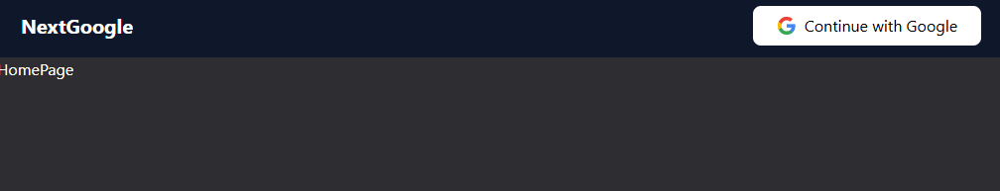
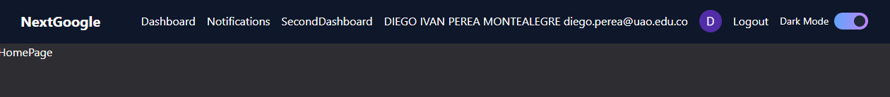
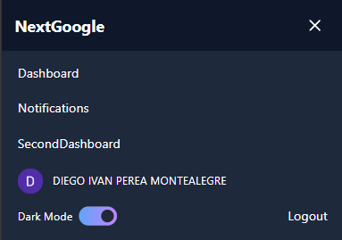
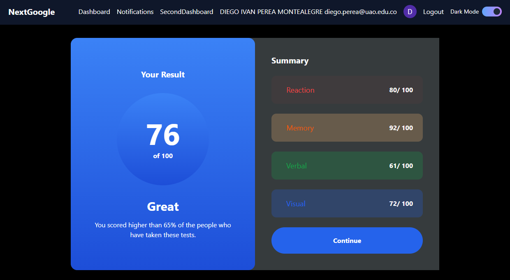
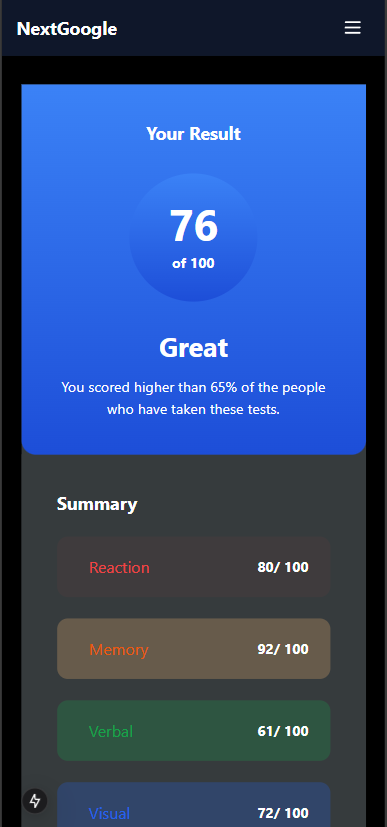
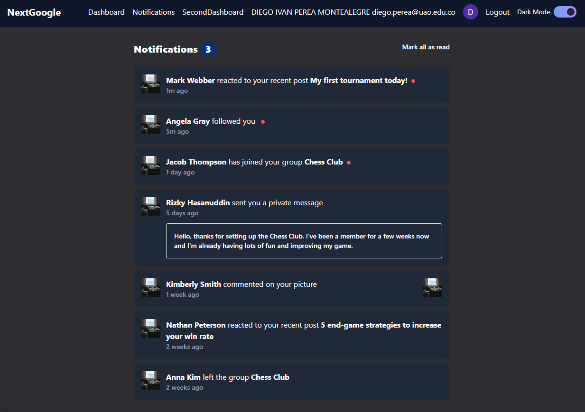
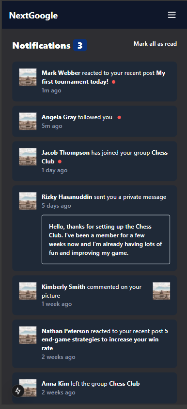
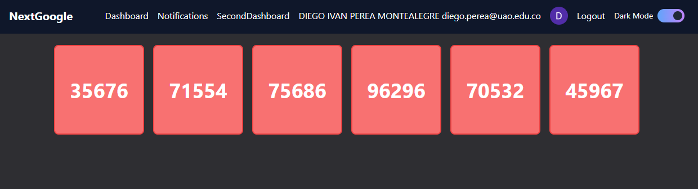
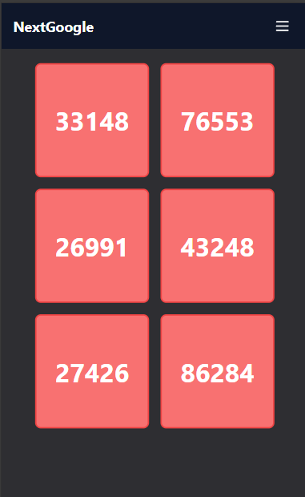

# Nextjs login google typescript  

<p align="justify">
 Nextjs login google typescript simple with tailwind where there is navigation bar, dark mode and dashboard.
</p>

> **Note:** In the file `.env`, set the `NEXTAUTH_SECRET` to the generated number from the [secret generator](https://generate-secret.vercel.app/32) or [visit documentation](https://next-auth.js.org/deployment#vercel) for more information.


HomePage
<p align="center">
  
</p>
Continue with Google
<p align="center">
  
</p>

Navbar Responsive
<p align="center">
  
</p>

Dashboard
<p align="center">
  
</p>

Dashboard Responsive
<p align="center">
  
</p>

Notifications
<p align="center">
  
</p>
Notifications Responsive
<p align="center">
  
</p>
SecondDashboard
<p align="center">
  
</p>
SecondDashboard Responsive
<p align="center">
  
</p>
-----

Fronted Nextjs Options for do it:

This is a [Next.js](https://nextjs.org/) project bootstrapped with [`create-next-app`](https://github.com/vercel/next.js/tree/canary/packages/create-next-app).

## Getting Started
Nodejs version v20.18.0 and Next.js version v15.0.3

First
```bash
npm install
```
run the development server:

```bash
npm run dev
# or
yarn dev
# or
pnpm dev
# or
bun dev
```

Open [http://localhost:3000](http://localhost:3000) with your browser to see the result.

Created by [Diego Ivan Perea Montealegre](https://github.com/diegoperea20)